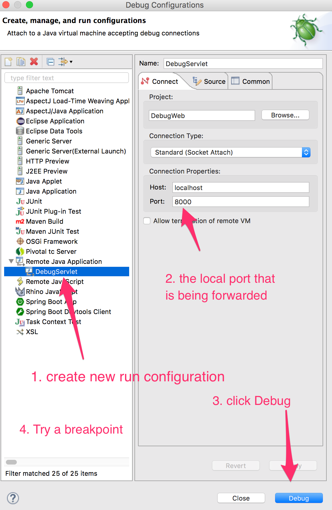

# Debug Framework
The Debug Framework contributes Java debug configuration to the application at runtime.  **Note:** This framework is only useful in Diego-based containers with SSH access enabled.

<table>
  <tr>
    <td><strong>Detection Criterion</strong></td>
    <td><tt>enabled</tt> set in the <tt>config/debug.yml</tt> file</td>
  </tr>
  <tr>
    <td><strong>Tags</strong></td>
    <td><tt>debug=&lt;port&gt;</tt></td>
  </tr>
</table>
Tags are printed to standard output by the buildpack detect script

## Configuration
For general information on configuring the buildpack, including how to specify configuration values through environment variables, refer to [Configuration and Extension][].

The framework can be configured by creating or modifying the [`config/debug.yml`][] file in the buildpack fork.

| Name | Description
| ---- | -----------
| `enabled` | Whether to enable Java debugging
| `port` | The port that the debug agent will listen on.  Defaults to `8000`.
| `suspend` | Whether to suspend execution until a debugger has attached.  Note, you cannot ssh to a container until the container has decided the application is running.  Therefore when enabling this setting you must also push the application using the parameter `-u process` which disables container health checking.

## Creating SSH Tunnel
After starting an application with debugging enabled, an SSH tunnel must be created to the container.  To create that SSH container, execute the following command:

```bash
$ cf ssh -N -T -L <LOCAL_PORT>:localhost:<REMOTE_PORT> <APPLICATION_NAME>
```

The `REMOTE_PORT` should match the `port` configuration for the application (`8000` by default).  The `LOCAL_PORT` can be any open port on your computer, but typically matches the `REMOTE_PORT` where possible.

Once the SSH tunnel has been created, your IDE should connect to `localhost:<LOCAL_PORT>` for debugging.



[`config/debug.yml`]: ../config/debug.yml
[Configuration and Extension]: ../README.md#configuration-and-extension
