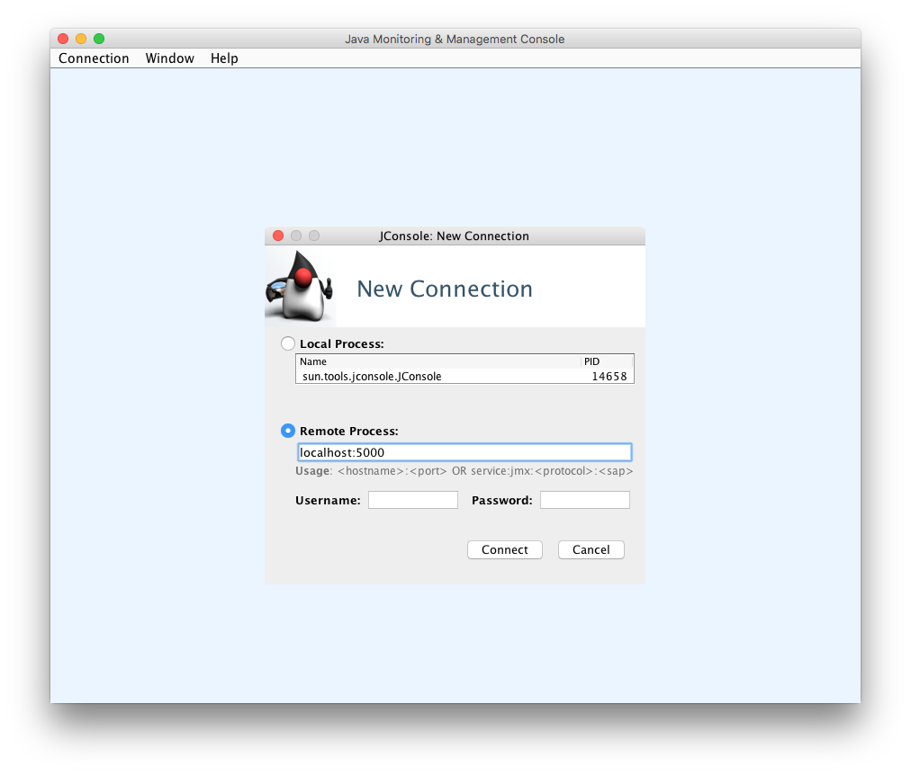

# JMX Framework
The JMX Framework contributes Java JMX configuration to the application at runtime.  **Note:** This framework is only useful in Diego-based containers with SSH access enabled.

<table>
  <tr>
    <td><strong>Detection Criterion</strong></td>
    <td><tt>enabled</tt> set via <tt>JBP_CONFIG_JMX</tt> or <tt>BPL_JMX_ENABLED</tt></td>
  </tr>
  <tr>
    <td><strong>Tags</strong></td>
    <td><tt>jmx=&lt;port&gt;</tt></td>
  </tr>
</table>
Tags are printed to standard output by the buildpack detect script

## Configuration
For general information on configuring the buildpack, including how to specify configuration values through environment variables, refer to [Configuration and Extension][].

The framework can be configured by setting the `JBP_CONFIG_JMX` environment variable.  The value must be valid inline YAML.  The Cloud Native Buildpacks environment variables `BPL_JMX_ENABLED` and `BPL_JMX_PORT` are also supported and take precedence over `JBP_CONFIG_JMX`.

| Name | Description
| ---- | -----------
| `enabled` | Whether to enable JMX.  Defaults to `false`.
| `port` | The port that the JMX agent will listen on.  Defaults to `5000`.

### Examples

Enable JMX on the default port:

```yaml
JBP_CONFIG_JMX: '{enabled: true}'
```

Enable JMX on a custom port:

```yaml
JBP_CONFIG_JMX: '{enabled: true, port: 6000}'
```

Using Cloud Native Buildpacks conventions:

```bash
BPL_JMX_ENABLED=true
BPL_JMX_PORT=6000
```

## Creating SSH Tunnel
After starting an application with JMX enabled, an SSH tunnel must be created to the container.  To create that SSH container, execute the following command:

```bash
$ cf ssh -N -T -L <LOCAL_PORT>:localhost:<REMOTE_PORT> <APPLICATION_NAME>
```

The `REMOTE_PORT` should match the `port` configuration for the application (`5000` by default).  The `LOCAL_PORT` must match the `REMOTE_PORT`.

Once the SSH tunnel has been created, your JConsole should connect to `localhost:<LOCAL_PORT>` for JMX access.



[Configuration and Extension]: ../README.md#configuration-and-extension
