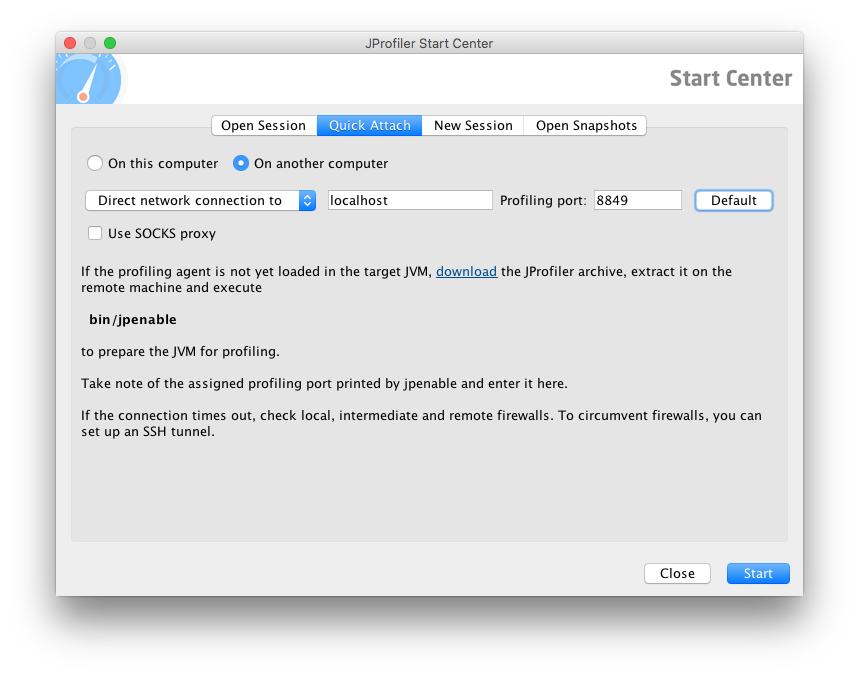

# JProfiler Profiler Framework
The JProfiler Profiler Framework contributes JProfiler configuration to the application at runtime.

<table>
  <tr>
    <td><strong>Detection Criterion</strong></td>
    <td><tt>enabled</tt> set in the <tt>config/jprofiler_profiler.yml</tt> file</td>
  </tr>
  <tr>
    <td><strong>Tags</strong></td>
    <td><tt>jprofiler-profiler=&lt;version&gt;</tt></td>
  </tr>
</table>
Tags are printed to standard output by the buildpack detect script

## Configuration
For general information on configuring the buildpack, including how to specify configuration values through environment variables, refer to [Configuration and Extension][].

The framework can be configured by creating or modifying the [`config/jprofiler_profiler.yml`][] file in the buildpack fork.  The framework uses the [`Repository` utility support][repositories] and so it supports the [version syntax][] defined there.

| Name | Description
| ---- | -----------
| `enabled` | Whether to enable the JProfiler Profiler
| `port` | The port that the JProfiler Profiler will listen on.  Defaults to `8849`.
| `nowait` | Whether to start process without waiting for JProfiler to connect first.  Defaults to `true`.
| `repository_root` | The URL of the JProfiler Profiler repository index ([details][repositories]).
| `version` | The version of the JProfiler Profiler to use. Candidate versions can be found in [this listing][].

## Creating SSH Tunnel
After starting an application with the JPorfiler Profiler enabled, an SSH tunnel must be created to the container.  To create that SSH container, execute the following command:

```bash
$ cf ssh -N -T -L <LOCAL_PORT>:localhost:<REMOTE_PORT> <APPLICATION_NAME>
```

The `REMOTE_PORT` should match the `port` configuration for the application (`8849` by default).  The `LOCAL_PORT` can be any open port on your computer, but typically matches the `REMOTE_PORT` where possible.

Once the SSH tunnel has been created, your JProfiler Profiler should connect to `localhost:<LOCAL_PORT>` for debugging.



[`config/jprofiler_profiler.yml`]: ../config/jprofiler_profiler.yml
[Configuration and Extension]: ../README.md#configuration-and-extension
[this listing]: http://download.pivotal.io.s3.amazonaws.com/jprofiler/index.yml
[repositories]: extending-repositories.md
[version syntax]: extending-repositories.md#version-syntax-and-ordering
