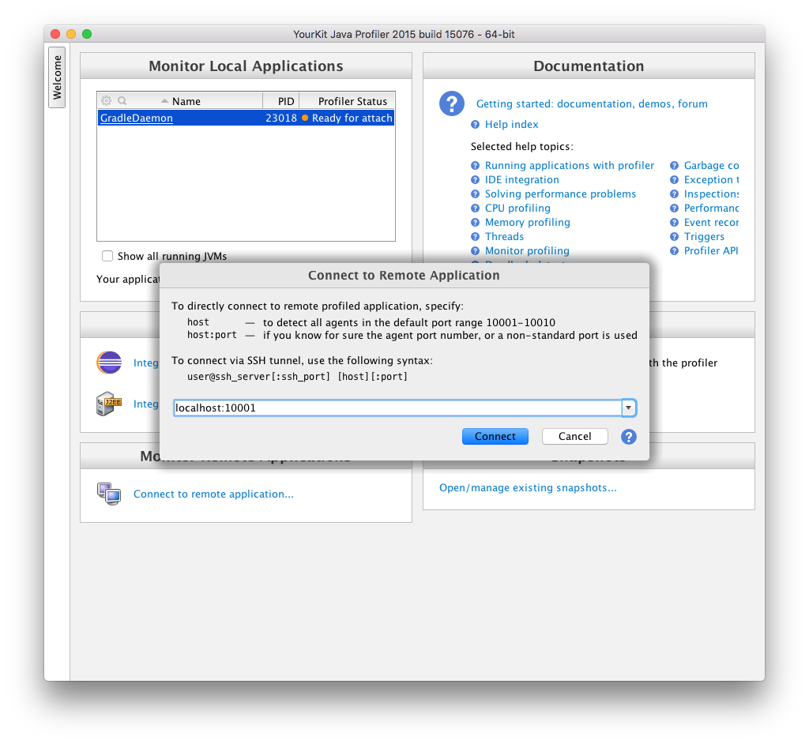

# YourKit Profiler Framework
The YourKit Profiler Framework contributes YourKit Profiler configuration to the application at runtime.

<table>
  <tr>
    <td><strong>Detection Criterion</strong></td>
    <td><tt>enabled</tt> set via <tt>JBP_CONFIG_YOUR_KIT_PROFILER</tt></td>
  </tr>
  <tr>
    <td><strong>Tags</strong></td>
    <td><tt>your-kit-profiler=&lt;version&gt;</tt></td>
  </tr>
</table>
Tags are printed to standard output by the buildpack detect script

## Configuration
For general information on configuring the buildpack, including how to specify configuration values through environment variables, refer to [Configuration and Extension][].

The framework can be configured by setting the `JBP_CONFIG_YOUR_KIT_PROFILER` environment variable.  The value must be valid inline YAML.

| Name | Description
| ---- | -----------
| `enabled` | Whether to enable the YourKit Profiler.  Defaults to `false`.
| `port` | The port that the YourKit Profiler will listen on.  Defaults to `10001`.

### Examples

Enable YourKit Profiler on the default port:

```yaml
JBP_CONFIG_YOUR_KIT_PROFILER: '{enabled: true}'
```

Enable YourKit Profiler on a custom port:

```yaml
JBP_CONFIG_YOUR_KIT_PROFILER: '{enabled: true, port: 10002}'
```

## Creating SSH Tunnel
After starting an application with the YourKit Profiler enabled, an SSH tunnel must be created to the container.  To create that SSH container, execute the following command:

```bash
$ cf ssh -N -T -L <LOCAL_PORT>:localhost:<REMOTE_PORT> <APPLICATION_NAME>
```

The `REMOTE_PORT` should match the `port` configuration for the application (`10001` by default).  The `LOCAL_PORT` can be any open port on your computer, but typically matches the `REMOTE_PORT` where possible.

Once the SSH tunnel has been created, your YourKit Profiler should connect to `localhost:<LOCAL_PORT>` for debugging.



[Configuration and Extension]: ../README.md#configuration-and-extension
